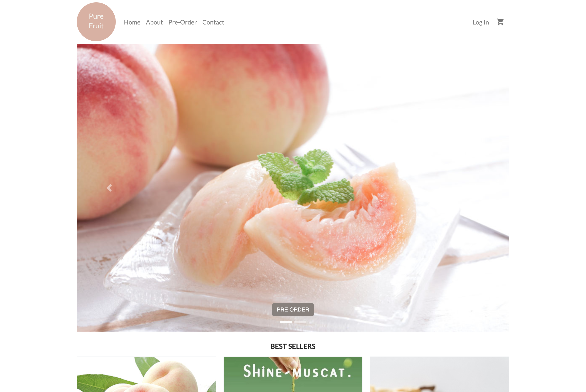
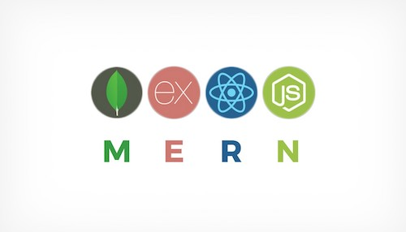

  # Pure Fruit: E-commerce Website For Pre-order Products

  

  ## Preview
  

  ## Description
  
  * Pure Fruit is a MERN application that provides customer shopping page and an admin page that allows business owner to handle orders and customer information.

  * Motivation for development: a desire to help small business owner to manage orders and customer information. Also, to give customer a website for product references and to place orders. 

  * User story  
    AS A small business owner  
    I WANT TO easily access details of customers information and their orders  
    SO THAT I can save time on counting numbers manually on social media pages  

  * As A customer  
    I WANT TO view and pre-order products  
    AND Know how to contact business owner if any issues  

  * Deployed application: https://nameless-oasis-57757.herokuapp.com/

  * Technologies used:   
    Node.js, Express, MongoDB, Mongoose,React, Heroku, Passport local Mongoose, axios, React router DOM, React Ticker, JSON web token (JWT), Express-session, etc.

  * Framework:  
    Bootstrap, Material UI, Semantic UI, React Admin

  ## Table of Contents
  * [Installation](#installation)
  * [Usage](#Usage)
  * [License](#License)
  * [Contributing](#Contributing)
  * [Questions](#Questions)

  ## Installation
  To install necessary dependencies, run the following command:

      npm i

  ## Usage
  To use this app directly, click on the Heroku link: https://nameless-oasis-57757.herokuapp.com/

  1. AS A CUSTOMER  
     You can order products, create login account, and login to place order.
    
  2. AS A BUSINESS OWNER
     You can login as Admin (username: admin, password:admin), view and export customer details, view and export order details (in .csv format).

  Enjoy!

  ## License
  * MIT

  ## Contributing
  This app is contributed by Melody Lo and Trilogy Education Services.

  ## Questions
  * If you have any questions, feel free to contact me via email: yiling.melody.lo@gmail.com
  * My GitHub profile: https://github.com/roukell
  * My portfolio: https://melodylo.com

  
  